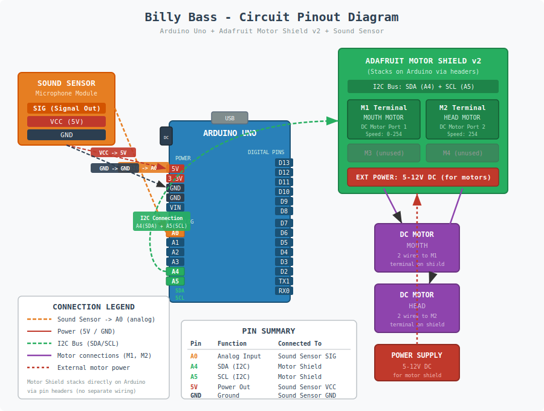

# Billy Bass

Sound-reactive Big Mouth Billy Bass using an Arduino Uno and Adafruit Motor Shield v2. The fish's mouth and head move in response to sound detected by a microphone module.

Based on code by Donald Bell, Maker Project Lab (2016).

## Circuit Pinout

## Hardware

- Arduino Uno (or compatible)
- Adafruit Motor Shield v2 (stacks on Arduino via pin headers)
- Sound sensor / microphone module (analog output)
- 2x DC motors (from Billy Bass: mouth and head)
- 5-12V external power supply (for motors)

## Wiring

| Pin | Function | Connects To |
|-----|----------|-------------|
| A0 | Analog Input | Sound sensor signal |
| 5V | Power | Sound sensor VCC |
| GND | Ground | Sound sensor GND |
| A4 (SDA) | I2C Data | Motor Shield (via headers) |
| A5 (SCL) | I2C Clock | Motor Shield (via headers) |
| Shield M1 | Motor Port 1 | Mouth motor |
| Shield M2 | Motor Port 2 | Head motor |

## How It Works

1. The sound sensor reads audio levels on analog pin A0
2. When the mapped sensor value exceeds a threshold of 30, both motors activate
3. The mouth motor ramps speed from 140 to 254, then releases
4. The head motor stays engaged until 3 seconds of silence, then releases

## Libraries

- [Adafruit Motor Shield v2](https://github.com/adafruit/Adafruit_Motor_Shield_V2_Library)
- Wire (built-in)
