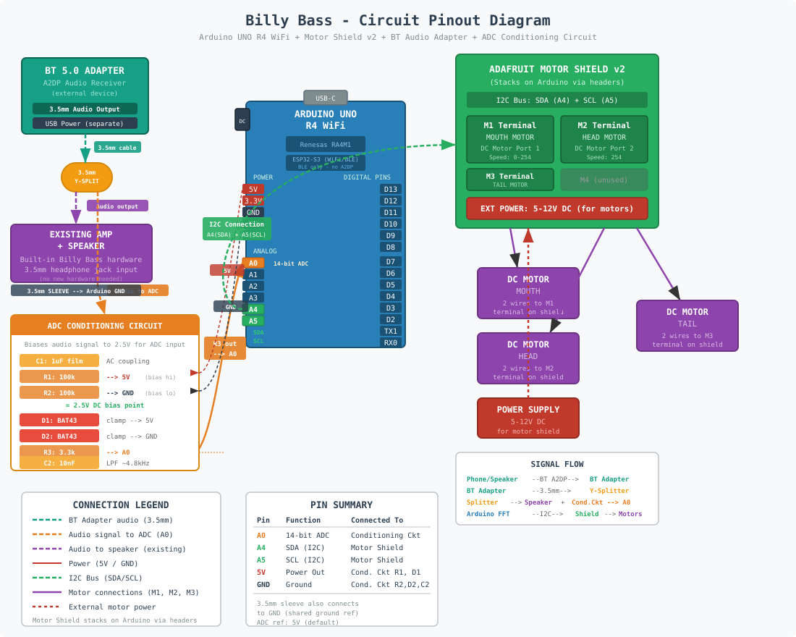

# Billy Bass

Sound-reactive Big Mouth Billy Bass using an Arduino Uno and Adafruit Motor Shield v2. The fish's mouth and head move in response to sound detected by a microphone module, and the tail flaps while the fish is speaking.

Based on code by Donald Bell, Maker Project Lab (2016).

## Circuit Pinout

## Hardware

- Arduino Uno (or compatible)
- Adafruit Motor Shield v2 (stacks on Arduino via pin headers)
- Sound sensor / microphone module (analog output)
- 3x DC motors (from Billy Bass: mouth, head and tail)
- 5-12V external power supply (for motors)

## Wiring

| Pin | Function | Connects To |
|-----|----------|-------------|
| A0 | Analog Input | Sound sensor signal |
| 5V | Power | Sound sensor VCC |
| GND | Ground | Sound sensor GND |
| D2 | Digital Input | Momentary button, other side to GND |
| A4 (SDA) | I2C Data | Motor Shield (via headers) |
| A5 (SCL) | I2C Clock | Motor Shield (via headers) |
| Shield M1 | Motor Port 1 | Mouth motor |
| Shield M2 | Motor Port 2 | Head motor |
| Shield M3 | Motor Port 3 | Tail motor |

The button is wired to **ground**, not to 5V, and read with the internal pull-up: the pin idles high and a press pulls it low. Feeding it from 5V leaves the pin floating whenever the button is not pressed, and a floating input reads pressed at random - the RA4M1 has internal pull-ups but no pull-downs, so that wiring cannot be fixed in firmware.

## How It Works

1. The sound sensor reads audio levels on analog pin A0
2. When the mapped sensor value exceeds a threshold of 30, the mouth and head motors activate
3. The mouth motor ramps speed from 140 to 254, then releases
4. The head motor drives out for 400ms - that stroke length is what sets how far the head comes out - then drops to a lower holding speed. It releases 3 seconds after the last sound and the return spring pulls it back in
5. While the fish is speaking, the tail flaps - driven for 150ms, released for 150ms, repeating. The tail can be switched off on its own, leaving the mouth and head working

## Motors Are Forward-Only

Every mechanism in the fish drives one way against a return spring and a hard stop. The spring provides the return stroke; running a motor backward just stalls it into the stop and chews through the nylon gear train.

Nothing in the firmware calls `run(BACKWARD)`, and there is no way to ask for it. The tail's back-and-forth flap is a forward drive stroke followed by a release stroke that the spring completes. `/motor` rejects a `dir` parameter outright rather than ignoring it, so a reverse request fails loudly instead of looking like a dead motor.

## Libraries

- [Adafruit Motor Shield v2](https://github.com/adafruit/Adafruit_Motor_Shield_V2_Library)
- Wire (built-in)
